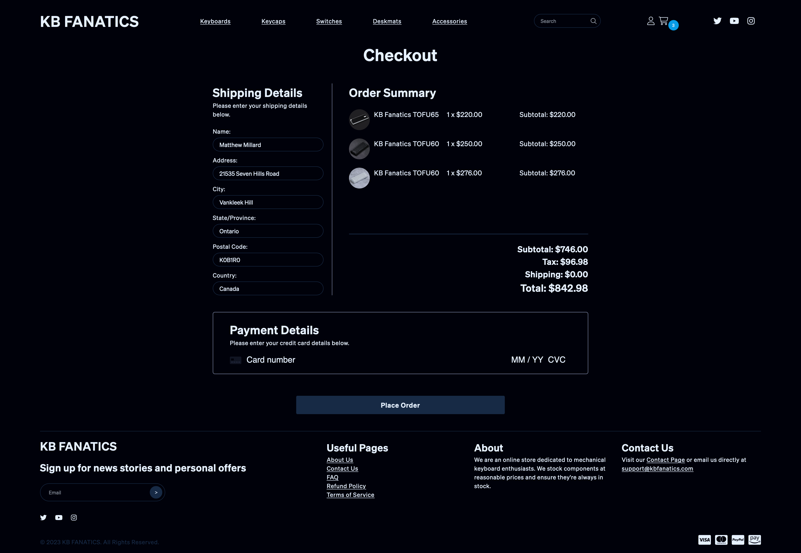

# KB FANATICS


## Description

KB FANATICS - a mock online store dedicated to mechanical keyboard enthusiasts. On the frontend, we utilize React and Apollo Client for an intuitive and dynamic user experience. For the backend, we've chosen NodeJS, Apollo Server, and MongoDB, providing a powerful, scalable, and real-time solution.

## Table Of Contents

- [Project Setup Guide](#project-setup-guide)
  - [Installation Steps](#installation-steps)
  - [Running the Application Locally](#running-the-application-locally)
- [ESLint and Prettier with Airbnb Style Guide](#eslint-and-prettier-with-airbnb-style-guide)
- [Visual Studio Code Configuration](#visual-studio-code-configuration)
- [Links](#links)
- [Screenshots](#screenshots)
- [Technologies Used](#technologies-used)
- [Node Packages Used](#node-packages-used)
- [Contributors](#contributors)
- [Contribution](#contribution)
- [License](#license)
- [Questions](#questions)

## Project Setup Guide

### Installation Steps

1. Clone this repository to your local machine.

2. Navigate to the project root directory.

3. Install the project dependencies by running `npm run install-all`. This will run the following script:

   ```JSON
    "install-all": "cd server && npm i && cd ../client && npm i",
   ```

4. Launch MongoDB Compass and connect to
   `mongodb://localhost:27017`.

5. Seed the database with the command npm run seed.

### Running the Application Locally

Launch the application with the command `npm run develop`.

## ESLint and Prettier with Airbnb Style Guide

We've chosen to adopt Airbnb's JavaScript Style Guide, one of the most popular code style guides for JavaScript. It promotes best practices, increases consistency and readability of our code, and helps us avoid common errors.

## Visual Studio Code Configuration

We also have a defined workspace configuration for Visual Studio Code (VS Code). This helps to maintain consistency across development environments when multiple developers work on the same project.

```json
{
  "eslint.options": {
    "overrideConfigFile": ".eslintrc.json"
  },
  "editor.defaultFormatter": "esbenp.prettier-vscode",
  "editor.formatOnSave": false,
  "editor.codeActionsOnSave": {
    "source.fixAll.eslint": true
  }
}
```

Here is an explanation of the settings:

- eslint.options: This tells VS Code to use our custom ESLint configuration file (.eslintrc.json) for linting the project.

- editor.defaultFormatter: We use Prettier as our default formatter. This is the extension ID for Prettier in VS Code.
  editor.formatOnSave: We set this to false to prevent VS Code from automatically formatting the entire file when you save it, which might conflict with our ESLint rules.

- editor.codeActionsOnSave: This setting is for applying automated fixes for issues that ESLint has detected when a file is saved. source.fixAll.eslint is set to true to fix all auto-fixable ESLint problems on save.

**_This configuration is saved in the .vscode/settings.json file in the project root. When you open this project in VS Code, these settings will be automatically applied to their editor._**

## Links

[Github Repository](https://github.com/matthew-millard/kb-fanatics)

[Deployed Website](https://kb-fanatics-2-c059b16fa22f.herokuapp.com/)

## Screenshots




## Technologies Used

- React 18
- Apollo Client
- GraphQL
- MongoDB Atlas & Compass
- Mongoose
- ExpressJS
- NodeJS

- Apollo Server

## Node Packages Used

- apollo/client ^3.7.17
- fortawesome/fontawesome-pro ^6.4.2
- reduxjs/toolkit ^1.9.5
- stripe/react-stripe-js ^2.1.2
- stripe/stripe-js ^2.0.0
- graphql ^16.7.1
- prop-types ^15.8.1
- react ^18.2.0
- react-dom ^18.2.0
- react-hook-form ^7.45.4
- react-icons ^4.10.1
- react-redux ^8.1.2
- react-router-dom ^6.14.2
- react-scripts 5.0.1
- react-spinners ^0.13.8
- stripe ^12.18.0
- apollo-server-express ^3.12.0
- dotenv ^16.3.1
- express ^4.18.2
- mongoose ^7.4.3
- aws-sdk ^2.1430.0
- jsonwebtoken ^9.0.1
- nodemailer ^6.9.4
- uuidv4 ^6.2.13
- eslint ^8.42.0
- prettier ^2.8.8
- bcrypt ^5.1.0
- nodemon ^2.0.22
- concurrently ^8.2.0

## Contributors

[Matthew Millard](https://github.com/matthew-millard)

[Christopher Rodrigues](https://github.com/rethissunstar)

[Marco Saverino](https://github.com/MarcoSaverino)

[Bruno Rosarini](https://github.com/RdySetShine)

[Valence Bememie](https://github.com/MVROZAY)

## Contribution

You're welcome to contribute to this project in several ways: you can help identify and resolve bugs or suggest new features, review and suggest modifications to the code, or enhance the project's documentation. All of these contributions can be made through submitting pull requests.

## License

MIT License A short and simple permissive license with conditions only requiring preservation of copyright and license notices. Licensed works, modifications, and larger works may be distributed under different terms and without source code.

## Questions

If you have any questions related to this project, please don't hesitate to [email me]rethissunstar@gmail.com).

If you would like to check out my other projects on Github: [Christopher Rodrigues](https://github.com/rethissunstar).

